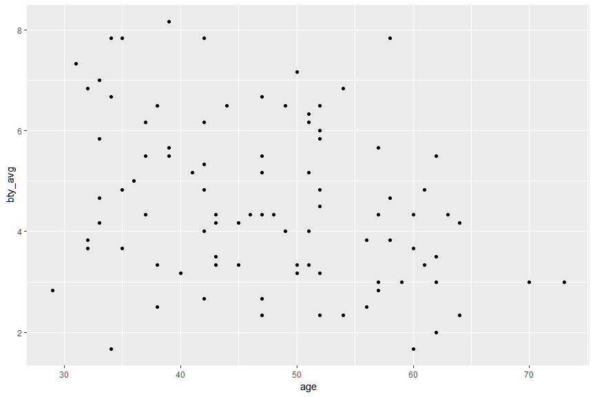
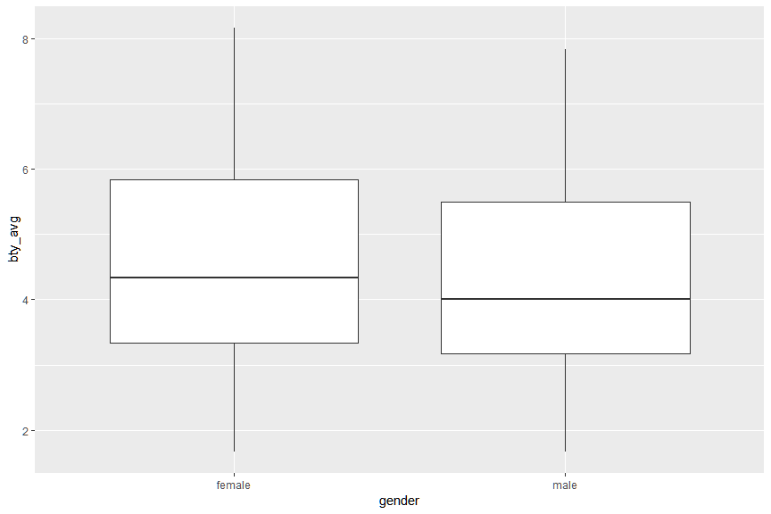
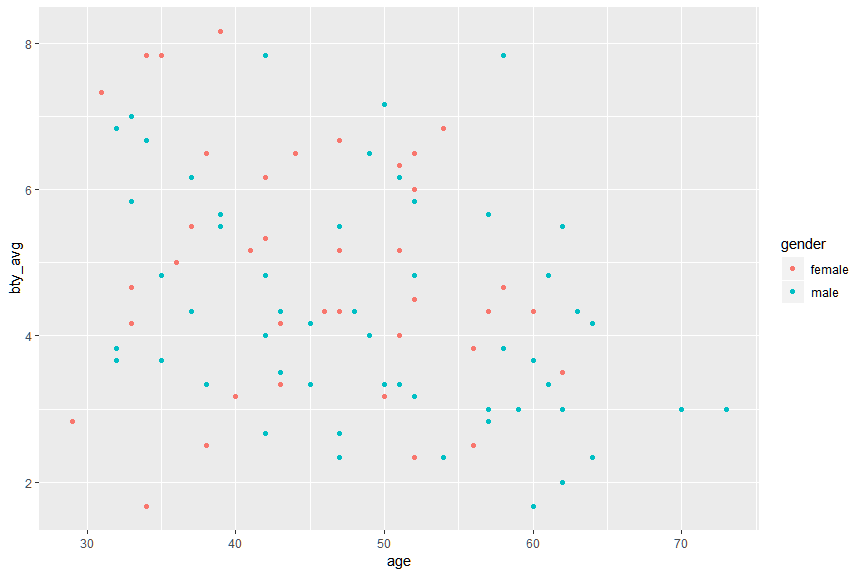
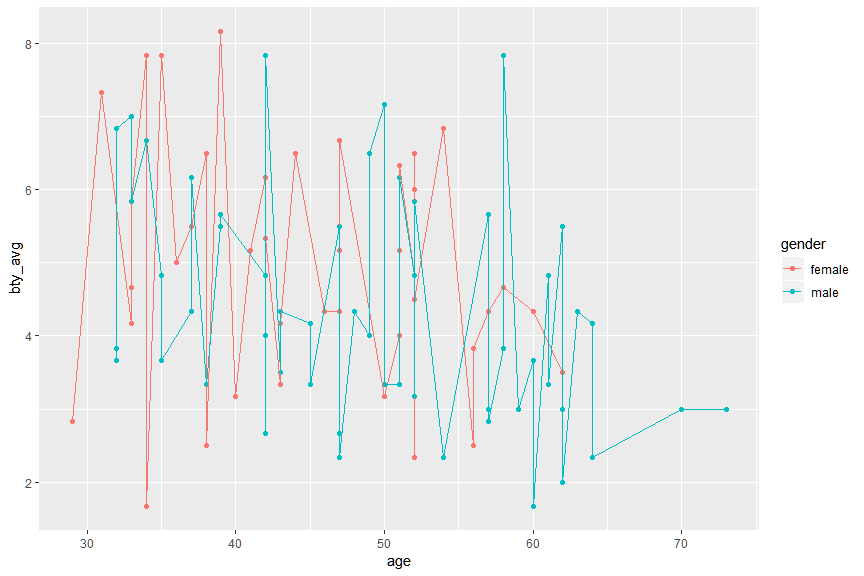
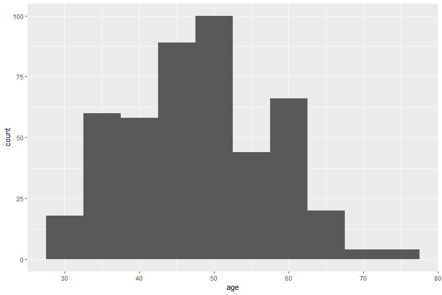
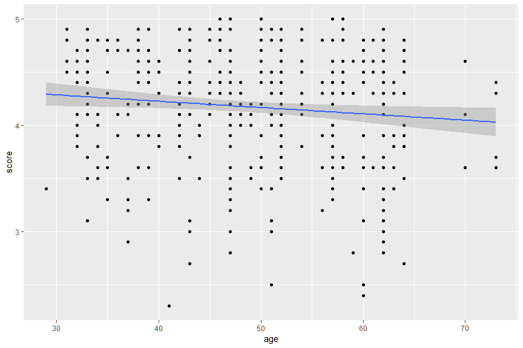
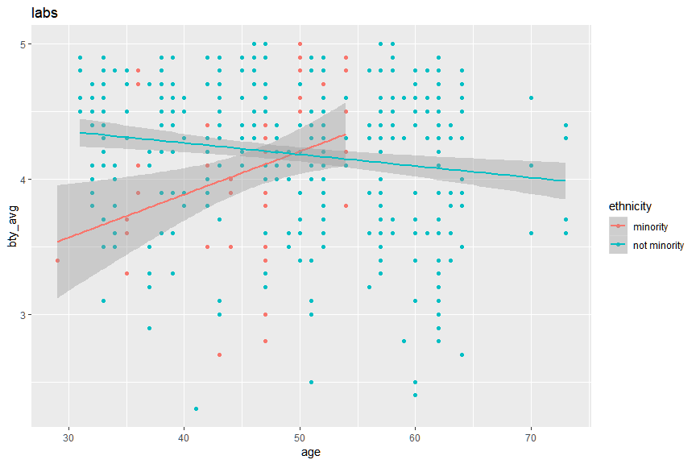

Dalam modul visualisasi ini, Anda akan menggunakan data `evals` dan paket `ggplot2`. Aktifkanlah paket untuk mengimpor data dan paket `ggplot2`!


```r
library(ggplot2)
library(readr)
```

Sekarang impor dataset `evals` melalui pranala "https://www.openintro.org/stat/data/evals.csv". Simpan obyek data tersebut dengan nama `evals`. (Petunjuk: `?read_csv`)


```r
evals <- read_csv("https://www.openintro.org/stat/data/evals.csv")
```

```
## Parsed with column specification:
## cols(
##   .default = col_double(),
##   rank = col_character(),
##   ethnicity = col_character(),
##   gender = col_character(),
##   language = col_character(),
##   cls_level = col_character(),
##   cls_profs = col_character(),
##   cls_credits = col_character(),
##   pic_outfit = col_character(),
##   pic_color = col_character()
## )
```

```
## See spec(...) for full column specifications.
```

```r
evals
```

```
## # A tibble: 463 x 21
##    score rank  ethnicity gender language   age cls_perc_eval cls_did_eval
##    <dbl> <chr> <chr>     <chr>  <chr>    <dbl>         <dbl>        <dbl>
##  1   4.7 tenu~ minority  female english     36          55.8           24
##  2   4.1 tenu~ minority  female english     36          68.8           86
##  3   3.9 tenu~ minority  female english     36          60.8           76
##  4   4.8 tenu~ minority  female english     36          62.6           77
##  5   4.6 tenu~ not mino~ male   english     59          85             17
##  6   4.3 tenu~ not mino~ male   english     59          87.5           35
##  7   2.8 tenu~ not mino~ male   english     59          88.6           39
##  8   4.1 tenu~ not mino~ male   english     51         100             55
##  9   3.4 tenu~ not mino~ male   english     51          56.9          111
## 10   4.5 tenu~ not mino~ female english     40          87.0           40
## # ... with 453 more rows, and 13 more variables: cls_students <dbl>,
## #   cls_level <chr>, cls_profs <chr>, cls_credits <chr>,
## #   bty_f1lower <dbl>, bty_f1upper <dbl>, bty_f2upper <dbl>,
## #   bty_m1lower <dbl>, bty_m1upper <dbl>, bty_m2upper <dbl>,
## #   bty_avg <dbl>, pic_outfit <chr>, pic_color <chr>
```

Anda dapat membuat grafik melalui `ggplot2` dengan menggunakan kode dengan struktur berikut:

```
ggplot(data, aes(x, y)) +
  geom_X()
```

Anda dapat mengganti `X` dengan `geom` yang sesuai. Misalnya `geom_point()` untuk menggambar titik, `geom_line` untuk menggambar garis, `geom_text` untuk memasukan teks dalam gambar. Perhatikan contoh berikut untuk membuat `scatterplot` antara `bty_avg` terhadap `age`.


```r
ggplot(data = evals, aes(x = age, y = bty_avg)) +
  geom_point()
```

<!-- -->

Sekarang dapatkah Anda membuat grafik dengan `gender` pada sumbu x dan `bty_avg` pada sumbu y? Serta gantilah `geom_point()` menjadi `geom_boxplot`. Grafik dan informasi apakah yang Anda dapatkan?


```r
ggplot(data = evals, aes(x = gender, y = bty_avg)) +
  geom_boxplot()
```

<!-- -->


Anda dapat menambahkan informasi mengenai variabel lain kedalam plot dengan menempatkannya pada bagian `aes()` dengan menggunakan `aesthetic` yang sesuai. Apa yang akan terjadi saat anda menambahkan informasi 'colour = gender' pada baris kode berikut?


```r
ggplot(data = evals, aes(x = age, y = bty_avg, colour = gender)) +
  geom_point()
```

<!-- -->

Selain menambahkan `aesthetic`, Anda juga dapat menambahkan `geometry` dengan cara menggunakan tanda `+`. Apa yang akan terjadi jika Anda menambahkan `geom_line` pada baris kode berikut? Menurut Anda data apakah yang cocok digunakan untuk jenis grafik tersebut?


```r
ggplot(data = evals, aes(x = age, y = bty_avg, colour = gender)) +
  geom_point() +
  geom_line()
```

<!-- -->

Pada contoh-contoh di atas, Anda menggunakan nilai `x` dan `y` sebagai `aesthetic`. Bagaimana jika Anda hanya menggunakan `x` saja? Jenis `geometry` apakah yang cocok digunakan jika hanya menggunakan satu nilai `x` tersebut? (Petunjuk: distribusi data)


```r
ggplot(data = evals, aes(x = age)) +
  geom_bar(binwidth = 5)
```

```
## Warning: `geom_bar()` no longer has a `binwidth` parameter. Please use
## `geom_histogram()` instead.
```

<!-- -->

Anda juga dapat membuat grafik yang berisi prediksi model dengan menggunakan `geom_smooth`. Buatlah grafik tersebut dengan menggunakan `geom_point()` dan `geom_smooth()`! Sumbu `x` adalah 'age' dan sumbu `y` adalag 'score'. (Pada contoh ini kita akan menggunakan metode regresi linear untuk model, sehingga argumen pada `geom_smooth()` diisi dengan 'method = "lm"').


```r
ggplot(data = evals, aes(x = age, y = score)) +
  geom_point() +
  geom_smooth(method = "lm")
```

<!-- -->

Bagaimana jika Anda menambahkan argumen 'colour = ethnicity' ke dalam `aes()`? Apakah yang terjadi dan dapatkah Anda menjelaskannya? Anda dipersilahkan untuk  mengganti label atau menambahkan judul pada grafik dengan menggunakan `labs`.


```r
ggplot(data = evals, aes(x = age, y = score, colour = ethnicity)) +
  geom_point() +
  geom_smooth(method = "lm") +
  labs(
    x = "age",
    y = "bty_avg",
    title = "labs"
  )
```

<!-- -->
