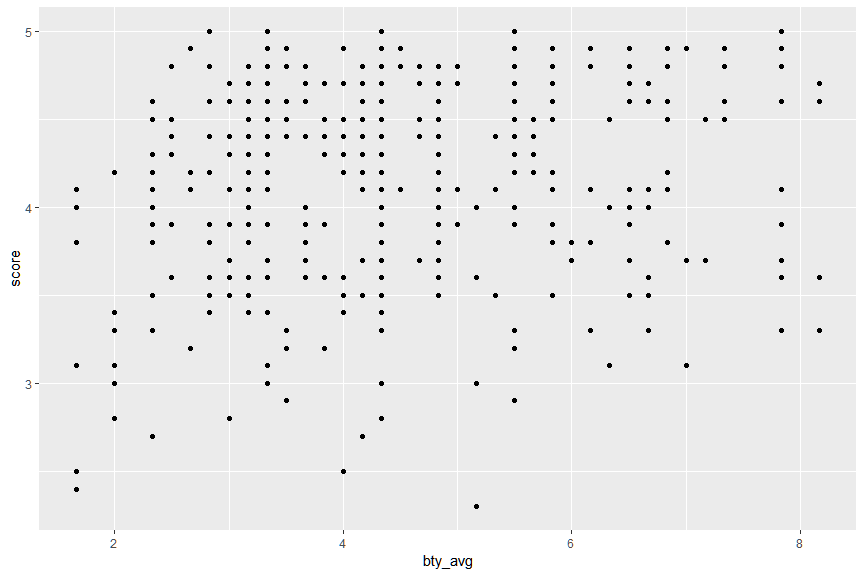

Pemodelan bertujuan utama untuk menyederhanakan suatu fenomena sehingga melalui penyederhanaan tersebut dapat didapatkan pemahaman dan/atau dapat dilakukan sebuah prediksi akan fenomena. Model dipergunakan untuk banyak bidang, misalnya di bidang *inferential statistic *, *causatial statistic*, *machine learning*, *artifical intelligence*, dan sebagainya.

Terdapat berbagai jenis model tersedia saat ini, contohnya : *tree-based model*, *neural network*, *deep learning* dan lain-lain. Namun, pada modul pengantar ini kita akan mempelajari satu jenis model mendasar yaitu regresi linier untuk membentuk pemahaman mengenai konsep modeling. Paket yang akan digunakan adalah `readr`, `modelr`, `broom` dan `ggplot2`. Aktifkanlah semua paket tersebut!


```r
library(readr)
library(modelr)
library(broom)
```

```
## 
## Attaching package: 'broom'
```

```
## The following object is masked from 'package:modelr':
## 
##     bootstrap
```

```r
library(ggplot2)
```

Dalam regresi linier selalu hanya ada satu *outcome variable* `y` dan satu atau lebih *predictor/explanatory variable(s)*. Anda akan mempergunakan dataset `evals` untuk melakukan pemodelan. Dataset `evals` tersebut berisikan skor penilaian terhadap pengajar beserta faktor-faktor lain yang berkaitan dengan individu pengajar atau kelas yang diajar. Imporlah dataset tersebut dengan melengkapi baris kode dibawah ini. Ada berapa observasi dan ada variabel pada dataset tersebut?


```r
evals <- read_csv("../data-raw/evals.csv")
```

```
## Parsed with column specification:
## cols(
##   .default = col_double(),
##   rank = col_character(),
##   ethnicity = col_character(),
##   gender = col_character(),
##   language = col_character(),
##   cls_level = col_character(),
##   cls_profs = col_character(),
##   cls_credits = col_character(),
##   pic_outfit = col_character(),
##   pic_color = col_character()
## )
```

```
## See spec(...) for full column specifications.
```

```r
evals
```

```
## # A tibble: 463 x 21
##    score rank  ethnicity gender language   age cls_perc_eval cls_did_eval
##    <dbl> <chr> <chr>     <chr>  <chr>    <dbl>         <dbl>        <dbl>
##  1   4.7 tenu~ minority  female english     36          55.8           24
##  2   4.1 tenu~ minority  female english     36          68.8           86
##  3   3.9 tenu~ minority  female english     36          60.8           76
##  4   4.8 tenu~ minority  female english     36          62.6           77
##  5   4.6 tenu~ not mino~ male   english     59          85             17
##  6   4.3 tenu~ not mino~ male   english     59          87.5           35
##  7   2.8 tenu~ not mino~ male   english     59          88.6           39
##  8   4.1 tenu~ not mino~ male   english     51         100             55
##  9   3.4 tenu~ not mino~ male   english     51          56.9          111
## 10   4.5 tenu~ not mino~ female english     40          87.0           40
## # ... with 453 more rows, and 13 more variables: cls_students <dbl>,
## #   cls_level <chr>, cls_profs <chr>, cls_credits <chr>,
## #   bty_f1lower <dbl>, bty_f1upper <dbl>, bty_f2upper <dbl>,
## #   bty_m1lower <dbl>, bty_m1upper <dbl>, bty_m2upper <dbl>,
## #   bty_avg <dbl>, pic_outfit <chr>, pic_color <chr>
```

Dalam studi kasus ini, Anda akan melakukan pemodelan untuk mempelajari hal-hal apa saja yang kemungkinan dapat mempengaruhi skor penilaian pengajar (variabel: `score`). Pembuatan model umumnya menggunakan *formula syntax* dengan format berikut:

```
model <- model_function(y ~ x1 + ... xn, data = dataset)
```
Anda ingin mengetahui hal-hal apa sajakah yang dapat mempengaruhi skor penilaian pengajar (`score`). Pertama Anda akan melakukan pengamatan pada variabel `bty_avg`. Lakukanlah pengamatan dengan membuat scatterplot dengan `bty_avg` pada sumbu x dan `score` pada sumbu y!


```r
ggplot(evals, aes(x = bty_avg, y = score)) +
  geom_point()
```

<!-- -->

Anda mendapati suatu fenomena pada grafik diatas, yaitu *overplotting*. *Overplotting* adalah kondisi dimana banyak titik-titik yang bertumpuk karena memiliki nilai yang sama. Hal tersebut dapat diperbaiki dengan menggunakan *jitter*. Dapatkah Anda menemukan perbedaan antara grafik di atas dengan grafik berikut? Berilah judul pada grafik berikut dan grafik sebelumnya.


```r
ggplot(evals, aes(x = bty_avg, y = score)) +
  geom_jitter() +
  labs(title = "OVERPLOTTING")
```

<!-- -->

Anda mendapati bahwa hanya dengan melakukan pengamatan dari grafik tidaklah cukup untuk mempelajari keterkaitan antara `score` dan `bty_avg`. Oleh karena itu, Anda ingin membuat pemodelan regresi linier untuk mempelajari keterkaitan antara kedua variabel tersebut. Buatlah pemodelan tersebut dengan menggunakan fungsi `lm()` dan simpanlah hasilnya dengan nama 'model1'! (Petunjuk: Jalankan `?lm` untuk membaca dokumentasi). Dapatkah Anda menuliskan persamaan linear yang didapatkan dari model1 tersebut?


```r
model1 <- lm(score ~ bty_avg, data = evals)
model1
```

```
## 
## Call:
## lm(formula = score ~ bty_avg, data = evals)
## 
## Coefficients:
## (Intercept)      bty_avg  
##     3.88034      0.06664
```

Anda dapat mengetahui kualitas dari model yang telah dibuat dengan menggunakan fungsi `summary()` atau `glance()` dan `tidy` (dari paket `broom`). Apakah perbedaan utama dari penggunaan kedua fungsi tersebut?


```r
summary(model1)
```

```
## 
## Call:
## lm(formula = score ~ bty_avg, data = evals)
## 
## Residuals:
##     Min      1Q  Median      3Q     Max 
## -1.9246 -0.3690  0.1420  0.3977  0.9309 
## 
## Coefficients:
##             Estimate Std. Error t value Pr(>|t|)    
## (Intercept)  3.88034    0.07614   50.96  < 2e-16 ***
## bty_avg      0.06664    0.01629    4.09 5.08e-05 ***
## ---
## Signif. codes:  0 '***' 0.001 '**' 0.01 '*' 0.05 '.' 0.1 ' ' 1
## 
## Residual standard error: 0.5348 on 461 degrees of freedom
## Multiple R-squared:  0.03502,	Adjusted R-squared:  0.03293 
## F-statistic: 16.73 on 1 and 461 DF,  p-value: 5.083e-05
```

```r
glance(model1)
```

```
## # A tibble: 1 x 11
##   r.squared adj.r.squared sigma statistic p.value    df logLik   AIC   BIC
##       <dbl>         <dbl> <dbl>     <dbl>   <dbl> <int>  <dbl> <dbl> <dbl>
## 1    0.0350        0.0329 0.535      16.7 5.08e-5     2  -366.  738.  751.
## # ... with 2 more variables: deviance <dbl>, df.residual <int>
```

```r
tidy(model1)
```

```
## # A tibble: 2 x 5
##   term        estimate std.error statistic   p.value
##   <chr>          <dbl>     <dbl>     <dbl>     <dbl>
## 1 (Intercept)   3.88      0.0761     51.0  1.56e-191
## 2 bty_avg       0.0666    0.0163      4.09 5.08e-  5
```

Selanjutnya Anda ingin mengetahui `fitted value` (nilai `y hat` yang didapatkan dari model) dan menambahkannya ke dalam scatterplot. Setidaknya ada dua cara untuk melakukan hal tersebut seperti contoh berikut: (lengkapi bagian "___")


```r
# menggunakan paket broom
model1_vals_broom <- 
  model1 %>% 
  augment()

ggplot(model1_vals_broom, aes(x = bty_avg, y = score)) +
  geom_point() +
  geom_line(aes(y = .fitted))
```

<!-- -->

```r
# menggunakan paket modelr
model1_vals_modelr <- 
  evals %>% 
  add_predictions(model1) %>% 
  add_residuals(model1)

ggplot(model1_vals_modelr, aes(x = bty_avg, y = score)) +
  geom_point() +
  geom_line(aes(y = pred))
```

<!-- -->

Perbedaan apa yang paling nampak antara `model1_vals_broom` dan `model1_vals_modelr`?


```r
model1_vals_broom
```

```
## # A tibble: 463 x 9
##    score bty_avg .fitted .se.fit   .resid    .hat .sigma .cooksd .std.resid
##    <dbl>   <dbl>   <dbl>   <dbl>    <dbl>   <dbl>  <dbl>   <dbl>      <dbl>
##  1   4.7    5       4.21  0.0266  0.486   0.00247  0.535 1.03e-3    0.911  
##  2   4.1    5       4.21  0.0266 -0.114   0.00247  0.535 5.60e-5   -0.213  
##  3   3.9    5       4.21  0.0266 -0.314   0.00247  0.535 4.27e-4   -0.587  
##  4   4.8    5       4.21  0.0266  0.586   0.00247  0.535 1.49e-3    1.10   
##  5   4.6    3       4.08  0.0339  0.520   0.00403  0.535 1.92e-3    0.974  
##  6   4.3    3       4.08  0.0339  0.220   0.00403  0.535 3.43e-4    0.412  
##  7   2.8    3       4.08  0.0339 -1.28    0.00403  0.532 1.16e-2   -2.40   
##  8   4.1    3.33    4.10  0.0305 -0.00244 0.00325  0.535 3.40e-8   -0.00457
##  9   3.4    3.33    4.10  0.0305 -0.702   0.00325  0.534 2.82e-3   -1.32   
## 10   4.5    3.17    4.09  0.0321  0.409   0.00361  0.535 1.06e-3    0.765  
## # ... with 453 more rows
```

```r
model1_vals_modelr
```

```
## # A tibble: 463 x 23
##    score rank  ethnicity gender language   age cls_perc_eval cls_did_eval
##    <dbl> <chr> <chr>     <chr>  <chr>    <dbl>         <dbl>        <dbl>
##  1   4.7 tenu~ minority  female english     36          55.8           24
##  2   4.1 tenu~ minority  female english     36          68.8           86
##  3   3.9 tenu~ minority  female english     36          60.8           76
##  4   4.8 tenu~ minority  female english     36          62.6           77
##  5   4.6 tenu~ not mino~ male   english     59          85             17
##  6   4.3 tenu~ not mino~ male   english     59          87.5           35
##  7   2.8 tenu~ not mino~ male   english     59          88.6           39
##  8   4.1 tenu~ not mino~ male   english     51         100             55
##  9   3.4 tenu~ not mino~ male   english     51          56.9          111
## 10   4.5 tenu~ not mino~ female english     40          87.0           40
## # ... with 453 more rows, and 15 more variables: cls_students <dbl>,
## #   cls_level <chr>, cls_profs <chr>, cls_credits <chr>,
## #   bty_f1lower <dbl>, bty_f1upper <dbl>, bty_f2upper <dbl>,
## #   bty_m1lower <dbl>, bty_m1upper <dbl>, bty_m2upper <dbl>,
## #   bty_avg <dbl>, pic_outfit <chr>, pic_color <chr>, pred <dbl>,
## #   resid <dbl>
```

Menariknya, dengan menggunakan `ggplot2` Anda bisa langsung menambahkan garis `fitted value` tersebut ke dalam grafik dengan menambahkan `geom_smooth()` pada baris kode. Lengkapilah baris kode tersebut dengan 'method' yang sesuai dan bandingkan hasilnya dengan grafik-grafik sebelumnya!


```r
ggplot(evals, aes(x = bty_avg, y = score)) +
  geom_point() +
  geom_smooth(method = "lm")
```

<!-- -->


Selanjutnya Anda tertarik untuk mempelajari keterkaitan antara `score` dengan `age`. Buatlah model untuk kedua variabel tersebut dan simpanlah dengan nama `model2`. Periksa bagaimana kualitas dari `model2` tersebut serta buatlah grafik menggunakan ggplot yang menyertakan garis `fitted value`!


```r
model2 <- lm(score ~ bty_avg, data = evals)

ggplot(evals, aes(x = score, y = age)) +
  geom_jitter() +
  geom_smooth(method = "lm")
```

<!-- -->

Anda telah membuat `model1` dan `model2` untuk mempelajari variabel `score`. Anda dapat menggunakan fungsi `spread_prediction()` dan `gather_prediction()` untuk menggabungkan `fitted value` dari dua model tersebut. Kemudian Anda dapat membuat plot dari variabel `score` versus `fitted value` (variabel `pred`) untuk melihat perbandingan antara kedua model melalui grafik. Kesimpulan apa yang dapat Anda


```r
evals %>% 
  gather_predictions(model1, model2) %>% 
  ggplot(aes(x = pred, y = score, colour = model)) +
  geom_point() +
  geom_smooth(method = "lm", se = FALSE)
```

<!-- -->
